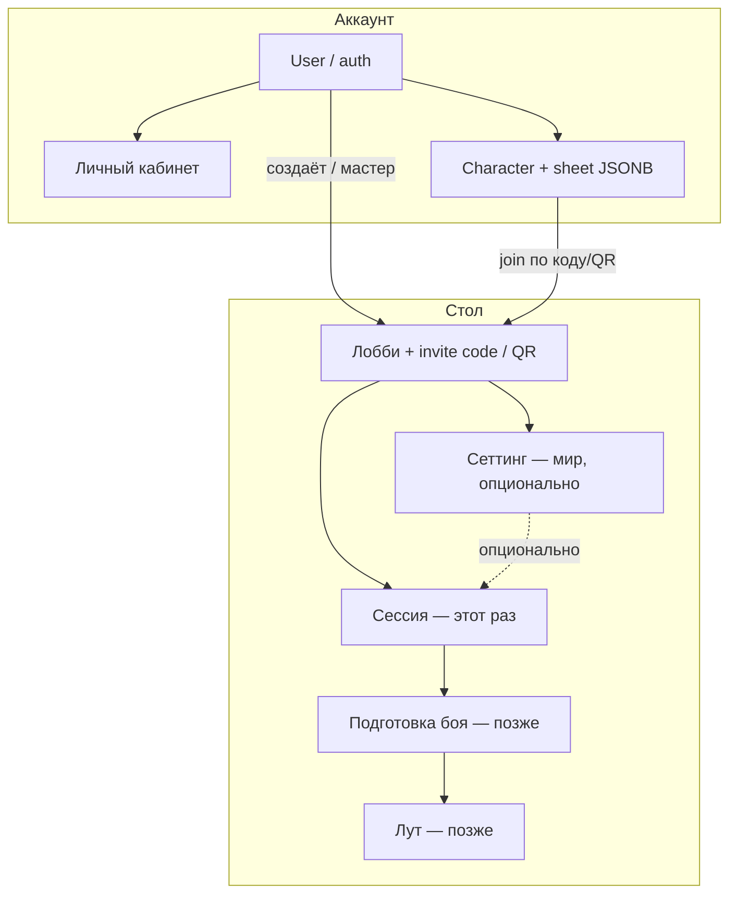
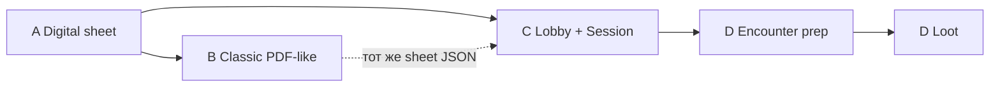

# Dvarf

Свой тулинг для DnD 5e (RU-first). **Не** форк и **не** обёртка над Long Story Short (LSS) — LSS только визуальный/IA-референс.

Цель продукта: быстро вести стол за столом и онлайн — от листа персонажа к общей пачке, подготовке боя и луту.

**North star MVP:**

```text
Лист персонажа  →  Лобби (код/QR)  →  Сессия / бой  →  Лут
     (есть)            (есть)            (далее)       (позже)
```

```text
Мои персонажи (аккаунт)
        ↓ код / QR → выбор персонажа
Лобби (создал мастер)
├── Сеттинг (мир, необязательно)
└── Сессия (этот раз; может быть без сеттинга)
```

## Срез агента «Фрейм для пачки» (2026-10-06)

Сделано в серверном продукте (не в Pages/`main`), залито на прод.

| Что | Статус |
|-----|--------|
| Модель: лобби → опциональный сеттинг → сессия (ваншот ок) | ✅ |
| Мастер создаёт лобби, получает код + QR | ✅ |
| Игрок: `/join/КОД` → выбирает персонажа | ✅ |
| Код на карточке персонажа | ✅ |
| Seat/unseat в сессии из состава лобби | ✅ |
| Nginx `/lobbies` `/sessions` `/settings` → API (фикс 405) | ✅ |
| Прод http://201.34.132.252/ `/health` ok, alembic `c9d0e1f2a3b4` | ✅ |
| Боевой фрейм / лут / realtime | ❌ очередь |

Ветка/PR: `cursor/lobby-join-table-3333` — https://github.com/igorpogulaev485-code/Dvarf/pull/18  
Ошибочный PR на localStorage/`main` (#12) закрыт.

Дальше этому контуру: **боевой фрейм на сессии** (план → ok). Не начинать encounter/loot раньше.

## Для агентов (обязательно прочитать)

**Сначала:** [`AGENTS.md`](AGENTS.md) — жёсткий контракт (анти-overwrite).  
Skills: [`.cursor/skills/dvarf-prod-lineage/SKILL.md`](.cursor/skills/dvarf-prod-lineage/SKILL.md) · [`.cursor/skills/dvarf-dev-workflow/SKILL.md`](.cursor/skills/dvarf-dev-workflow/SKILL.md).  
Живой срез фич: [`PRODUCT_STATUS.md`](PRODUCT_STATUS.md).

- Итерации: **короткий план → ok от Игоря → код / commit / push / PR**. Без ok код не писать.
- Ветки: `cursor/<name>-acbe` (от **prod tip**, не от голого `main`/старой развилки). В `main` только через PR.
- **Prod tip сейчас:** `cursor/restore-sheet-classic-acbe`. Деплой только с дерева, где tip уже влит.
- Деплой на Timeweb **только** по явной просьбе («залей на сервер»). `./deploy/sync-and-up.sh` **затирает весь** `/opt/dvarf` кроме `.env` — тонкая ветка убивает чужие фичи. Перед деплоем: `./deploy/preflight-prod.sh`. См. [`deploy/README.md`](deploy/README.md).
- После деплоя: проверить маркеры (лобби, кабинет, лист, classic) на живом сервере; в `PRODUCT_STATUS` писать «на проде» только по факту.
- Параллельные агенты: PR можно параллельно; **на сервер — один интегрированный деплой от tip**. Не деплоить каждый свою развилку.
- Секреты не коммитить. Cloud Agent: `DVARF_SSH_PRIVATE_KEY` = **полный** OpenSSH PEM (`BEGIN`…`END`).
- Каталоги: свой seed + SRD (CC-BY). API TTG недоступен; ждём dnd.su; **чужие сайты не скрейпим**.

## Продуктовые принципы

| Тема | Решение |
|------|---------|
| Роли | Глобальной роли «мастер / игрок» **нет**. Мастер — кто создал **лобби**. |
| Auth | Тонкий: email/password + JWT; OAuth (Yandex/VK) по мере секретов. Биллинг — позже. |
| UI | React mobile-first (позже React Native). Визуальный редизайн — с дизайнером позже. |
| Данные листа | Hybrid: summary-колонки + JSONB `sheet` + `sheet_version` (optimistic concurrency, 409). |
| Переиспользование | Чистая логика в `frontend/src/shared/dnd/*` — лист и стол. |

## Карта домена (связи)



## Лобби / сеттинг / сессия

- **Лобби** — место игры. Мастер создаёт → получает **код** и **QR** (`/join/КОД`).
- **Вход игрока:** QR/код → логин → выбрать персонажа; или код на карточке персонажа.
- **Сеттинг** — мир внутри лобби (необязателен).
- **Сессия** — сегодняшний стол; `setting_id` может быть `null` (ваншот). Удаление сеттинга отвязывает сессии.
- Бой и лут — на сессии (ещё не сделано).
- У LSS «комната» ближе к **сессии**, не к сеттингу.
- **Прод:** залито; nginx проксирует `/lobbies`, `/sessions`, `/settings` на API (как `/characters`). SPA-навигация с `Accept: text/html` без Bearer по-прежнему отдаёт `index.html`.

## Дорожная карта

### Фаза A — Digital sheet MVP *(закрыт для соло-игры)*

Одиночный интерактивный лист: создать → заполнить → играть (бой/отдых/заклинания).  
**Готово как playable MVP**, не как полный автомат PHB: много правил всё ещё вручную (см. Polish / gaps ниже).

| Слайс | Содержание | Статус |
|-------|------------|--------|
| Auth + characters | JWT, CRUD, JSONB sheet | ✅ |
| Core sheet | abilities / saves / skills / sticky combat | ✅ |
| Attacks + inventory | оружие/артефакты, вес STR×15 | ✅ |
| Text blocks | rename / hide / reorder | ✅ |
| Spells S1–S4 | slots, prepare, cast, grimoire | ✅ |
| Play S1–S2 | conditions, exhaustion, resources, rest, temp HP, hit dice, death saves | ✅ |
| Sheet S3 | XP, subclass/background/alignment, passives, darkvision, armor/weapon prof | ✅ |
| Sheet S4+ | pact magic UI, attunement, короткий/продолжительный отдых | ✅ |
| Polish | multiclass, race→эффекты, rich-text, auto AC/slots/upcast | backlog |

### Фаза B — Classic PDF-like *(параллельно другим агентом)*

Второй UI поверх **того же** `Character.sheet` (не вторая модель данных).

- Цель: привычная «бумажная» раскладка + интерактив.
- Зависимость: digital JSON-контракт листа стабилен (фаза A).
- Агентам PDF: не ломать digital-роуты и `shared/dnd` без согласования.

### Фаза C — Лобби + сессия *(каркас на проде)*

1. ✅ Модель Lobby / Setting / PlaySession + seat  
2. ✅ Invite code + QR join + код на персонаже  
3. ✅ UI `/lobbies`, `/join/:code`, сеттинг, фрейм сессии (состав стола)  
4. ✅ Nginx proxy `/lobbies|/sessions|/settings` → API (иначе POST ловил 405)  
5. ⏳ Общий **боевой** фрейм на сессии (инициатива / статусы)  
6. ⏳ Realtime (WebSocket) по необходимости  

### Фаза D — Подготовка боя → лут

Зависимости: сессия в лобби (C).

1. Encounter prep (инициатива, участники боя, статусы стола).
2. Loot (раздача / учёт после боя).



## Статус кода (сейчас)

Уже в продуктовой ветке / на проде:

- Auth (register/login/refresh, auto-refresh на 401), cabinet profile
- Characters CRUD, hybrid JSONB + `sheet_version` (409)
- Catalogs: races / classes / weapons / items / spells / conditions (+ seeds)
- Sheet: identity (+ XP/subclass/background/alignment), abilities, saves, skills
- Attacks, sticky combat, multi-tab BroadcastChannel sync
- Text blocks + reorder; inventory + weight
- Spells S1–S4; Play S1–S2; Sheet S3 passives/proficiencies
- Sheet S4+: pact magic, attunement (max 3), short-rest hit-die heal
- **Лобби / сеттинг / сессия (каркас):** create lobby, invite code + QR, join с выбором персонажа, код на карточке, сеттинг (опционально), сессия (ваншот или с сеттингом), seat/unseat из лобби
- Alembic head на проде: `c9d0e1f2a3b4` (lobbies/settings/sessions)
- Prod Docker deploy (Timeweb)

Прод: http://201.34.132.252/ — подробности в [`deploy/README.md`](deploy/README.md).  
PR этого слайса: https://github.com/igorpogulaev485-code/Dvarf/pull/18 (`cursor/lobby-join-table-3333`).

## Очередь ближайших слайсов

1. Боевой фрейм на сессии (инициатива / статусы стола) — план → ok  
2. Classic PDF-like — параллельный агент (тот же sheet)  
3. Encounter prep → loot  

Backlog (не начинать без плана): multiclass; race → эффекты на лист; rich-text в блоках; onboarding → тема UI; phone/SMS login; Google OAuth (гео-ограничения для RF); открыть сеттинг игрокам; QR polish / срок жизни кода.
## Стек

- Frontend: React + Vite (`src/ui`, `src/features`, `src/pages`, `src/shared`)
- Backend: Python + FastAPI (REST)
- DB: PostgreSQL + Alembic
- Auth: email/password + JWT; OAuth Yandex/VK — по секретам

## Репозиторий и деплой

- Ветки `cursor/<name>-eb8e`; после слайса: commit → push → обновить PR
- Не коммитить `.env` с ключами (только `.env.example` / `.env.prod.example`)
- Деплой: `./deploy/sync-and-up.sh` (нужен SSH; Cloud Agent — secret `DVARF_SSH_PRIVATE_KEY`)

Основной PR разработки: открытые PR в репо (обычно auth/sheet ветка).

## Backend (локально)

```bash
docker compose up -d db
cd backend
python3 -m venv .venv
source .venv/bin/activate
pip install -r requirements.txt
cp .env.example .env
alembic upgrade head
uvicorn app.main:app --reload --port 8000
```

Auth: `POST /auth/register|login|refresh|logout`, `GET /auth/me`, OAuth stubs/start.  
Characters / catalog — `/characters`, `/catalog`.  
Lobbies / settings / sessions — `/lobbies`, `/lobbies/join`, `/settings/{id}`, `/sessions/{id}` (+ seats).

## Frontend (локально)

```bash
cd frontend
npm install
npm run dev
```

Dev UI: `http://127.0.0.1:5173` (Vite проксирует API на `:8000`).
