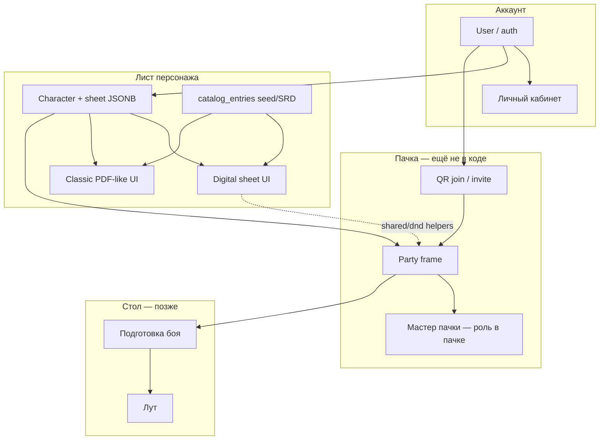
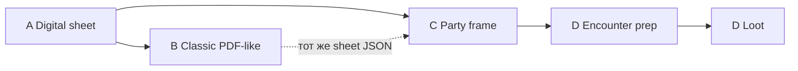

# Dvarf

Свой тулинг для DnD 5e (RU-first). **Не** форк и **не** обёртка над Long Story Short (LSS) — LSS только визуальный/IA-референс.

Цель продукта: быстро вести стол за столом и онлайн — от листа персонажа к общей пачке, подготовке боя и луту.

**North star MVP:**

```text
Лист персонажа  →  Фрейм пачки  →  Подготовка боя  →  Лут
     (сейчас)         (далее)         (позже)        (позже)
```

## Для агентов (обязательно прочитать)

- Итерации: **короткий план → ok от Игоря → код / commit / push / PR**. Без ok код не писать.
- Ветки: `cursor/<name>-eb8e`, в `main` только через PR.
- Деплой на Timeweb **только** по явной просьбе («залей на сервер»). См. [`deploy/README.md`](deploy/README.md).
- Секреты не коммитить. Для деплоя Cloud Agent: secret `DVARF_SSH_PRIVATE_KEY`.
- Параллельные агенты: **не ломать чужой контур**. Digital sheet и classic PDF-like могут идти параллельно; пачку / encounter / loot не начинать раньше очереди без отдельного ok.
- Каталоги: свой seed + SRD (CC-BY). API TTG недоступен; ждём dnd.su; **чужие сайты не скрейпим**.

## Продуктовые принципы

| Тема | Решение |
|------|---------|
| Роли | Глобальной роли «мастер / игрок» **нет**. Мастер появляется **только в контексте пачки**. |
| Auth | Тонкий: email/password + JWT; OAuth (Yandex/VK) по мере секретов. Биллинг — позже. |
| UI | React mobile-first (позже React Native). Визуальный редизайн — с дизайнером позже. |
| Данные листа | Hybrid: summary-колонки + JSONB `sheet` + `sheet_version` (optimistic concurrency, 409). |
| Переиспользование | Чистая логика в `frontend/src/shared/dnd/*` — лист сейчас, **фрейм пачки потом**. |

## Карта домена (связи)



**Смысл стрелок:** лист и каталог — фундамент; пачка читает листы участников и вводит роль мастера; бой и лут опираются на пачку, не на «голый» одиночный лист.

## Фрейм пачки (продуктовый набросок)

Ещё **не реализован** — держим в README, чтобы параллельные агенты не «забывали» контур.

- **Зачем:** несколько игроков за одним столом видят общий фрейм (статы/статусы/ресурсы), а не только свои экраны.
- **Вход:** QR / invite — join «аккаунт к аккаунту» в пачку (детали протокола — отдельный план-слайс).
- **Мастер пачки:** назначается в контексте этой пачки (не глобальный флаг в профиле).
- **Техзадел:** VPS выбран в т.ч. под будущий realtime (WebSocket); хелперы rest/spells/weight пишутся без привязки к UI листа.
- **Не делать сейчас:** схему БД пачки, WS, QR — пока нет отдельного ok на слайс.

## Дорожная карта

### Фаза A — Digital sheet MVP *(закрыт для соло-игры)*

Одиночный интерактивный лист: создать → заполнить → играть (бой/отдых/заклинания).  
**Готово как playable MVP**, не как полный автомат PHB: много правил всё ещё вручную (см. Polish / gaps ниже).

| Слайс | Содержание | Статус |
|-------|------------|--------|
| Auth + characters | JWT, CRUD, JSONB sheet | ✅ |
| Core sheet | abilities / saves / skills / sticky combat | ✅ |
| Attacks + inventory | оружие/артефакты, вес STR×15 | ✅ |
| Text blocks | rename / hide / reorder | ✅ |
| Spells S1–S4 | slots, prepare, cast, grimoire | ✅ |
| Play S1–S2 | conditions, exhaustion, resources, rest, temp HP, hit dice, death saves | ✅ |
| Sheet S3 | XP, subclass/background/alignment, passives, darkvision, armor/weapon prof | ✅ |
| Sheet S4+ | pact magic UI, attunement, короткий/продолжительный отдых | ✅ |
| Polish | multiclass, race→эффекты, rich-text, auto AC/slots/upcast | backlog |

### Фаза B — Classic PDF-like *(параллельно другим агентом)*

Второй UI поверх **того же** `Character.sheet` (не вторая модель данных).

- Цель: привычная «бумажная» раскладка + интерактив.
- Зависимость: digital JSON-контракт листа стабилен (фаза A).
- Агентам PDF: не ломать digital-роуты и `shared/dnd` без согласования.

### Фаза C — Фрейм пачки

Зависимости: стабильный лист (A), аккаунт/join.

1. Модель Party + участники + роль «мастер пачки».
2. QR / invite join.
3. Общий фрейм (чтение листов / боевые виджеты).
4. Realtime (WebSocket) — по необходимости после первого sync-среза.

### Фаза D — Подготовка боя → лут

Зависимости: пачка (C).

1. Encounter prep (инициатива, участники боя, статусы стола).
2. Loot (раздача / учёт после боя).



## Статус кода (сейчас)

Уже в продуктовой ветке / PR (digital):

- Auth (register/login/refresh, auto-refresh на 401), cabinet profile
- Characters CRUD, hybrid JSONB + `sheet_version` (409)
- Catalogs: races / classes / weapons / items / spells / conditions (+ seeds)
- Sheet: identity (+ XP/subclass/background/alignment), abilities, saves, skills
- Attacks, sticky combat, multi-tab BroadcastChannel sync
- Text blocks + reorder; inventory + weight
- Spells S1–S4; Play S1–S2; Sheet S3 passives/proficiencies
- Sheet S4+: pact magic, attunement (max 3), short-rest hit-die heal
- Prod Docker deploy (Timeweb)

Прод: http://201.34.132.252/ — подробности в [`deploy/README.md`](deploy/README.md).

## Очередь ближайших слайсов

1. **Classic PDF-like** — параллельный агент (тот же sheet)  
2. **Party frame** — отдельный план → ok (QR join, мастер пачки)  
3. Encounter prep → loot  

Backlog (не начинать без плана): multiclass; race → эффекты на лист; rich-text в блоках; onboarding → тема UI; phone/SMS login; Google OAuth (гео-ограничения для RF).

## Стек

- Frontend: React + Vite (`src/ui`, `src/features`, `src/pages`, `src/shared`)
- Backend: Python + FastAPI (REST)
- DB: PostgreSQL + Alembic
- Auth: email/password + JWT; OAuth Yandex/VK — по секретам

## Репозиторий и деплой

- Ветки `cursor/<name>-eb8e`; после слайса: commit → push → обновить PR
- Не коммитить `.env` с ключами (только `.env.example` / `.env.prod.example`)
- Деплой: `./deploy/sync-and-up.sh` (нужен SSH; Cloud Agent — secret `DVARF_SSH_PRIVATE_KEY`)

Основной PR разработки: открытые PR в репо (обычно auth/sheet ветка).

## Backend (локально)

```bash
docker compose up -d db
cd backend
python3 -m venv .venv
source .venv/bin/activate
pip install -r requirements.txt
cp .env.example .env
alembic upgrade head
uvicorn app.main:app --reload --port 8000
```

Auth: `POST /auth/register|login|refresh|logout`, `GET /auth/me`, OAuth stubs/start.  
Characters / catalog — `/characters`, `/catalog`.

## Frontend (локально)

```bash
cd frontend
npm install
npm run dev
```

Dev UI: `http://127.0.0.1:5173` (Vite проксирует API на `:8000`).
